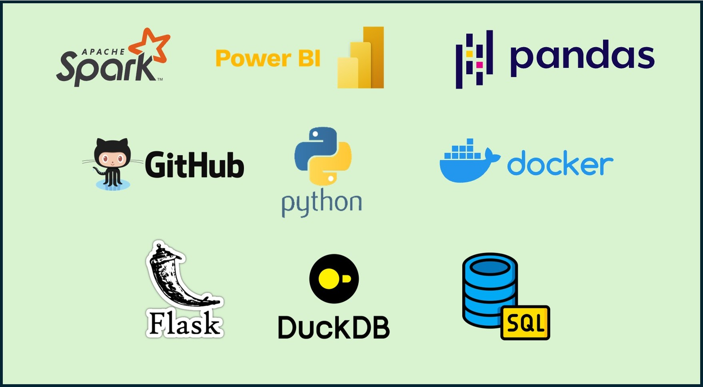

### Olá, sou Homailson! 👋

Sou **professor de Matemática no ensino básico**, atuando no período da manhã, e **profissional em na área de Dados & Inteligência Artificial**.  
Minha trajetória integra **educação, tecnologia e ciência de dados**, com foco em automação, análise e soluções práticas.

- 🔭 Professor de Matemática no ensino básico  
- 🎓 Licenciado em Matemática – **UNISAL**  
- 🎓 Tecnólogo em Ciência de Dados – **UNINTER**  
- 🎓 Mestre em Ciências – **USP**  
- 💼 Engenheiro de dados Trainee em **Data & AI** na **Compass UOL**

- 🌱 Tecnologias e ferramentas com as quais estudo e trabalho:
  **Git & GitHub, Linux, AWS, Python, Flask, Jinja, PySpark, Docker, Power BI, CloudFormation**

- ☁️ Ex-aluno do **Programa de Bolsas em Data & Analytics – Compass UOL**
- 🏅 Certificações AWS
- 😄 Pronomes: **ele/dele (he/him)**

---

### 🏅 Certificações AWS

  
  

---

### 🌐 Portfólio pessoal

---

### 📊 GitHub Stats

---

### 🛠️ Principais Tecnologias

---

### 📫 Contato

 
  
  
     

